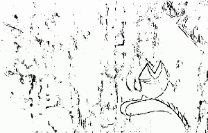
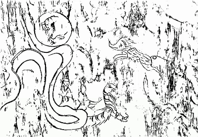
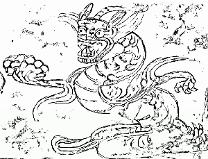

# MGDF

Online demo: https://huggingface.co/spaces/TIVEN010221/MGDF

---

## Detection Results Display

Below are the detection results for different mural images:

| Mural | Multi-Granularity Detection |
|--------|----------|
|  |  |
|  |  |
|  |  |
|  |  |
|  |  |

### Gradio Interface Demo

This project uses the Gradio framework to build an interactive user interface for model inference and visualization. The image below shows the design and functionality of the Gradio interface:

The interface provides an intuitive way for users to input data, adjust parameters, and view the model's output results in real-time.
