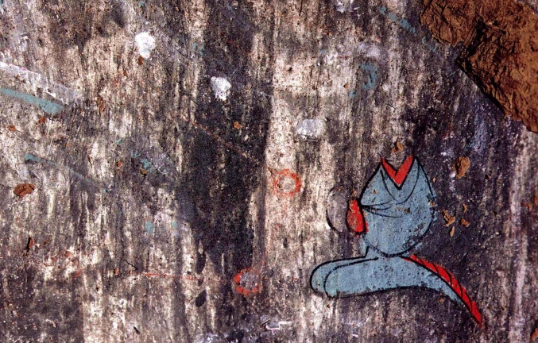
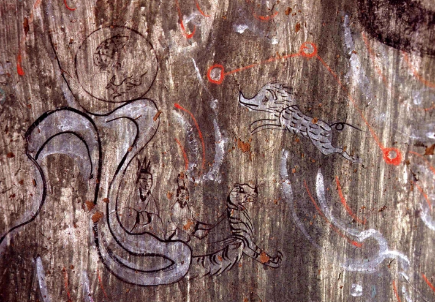
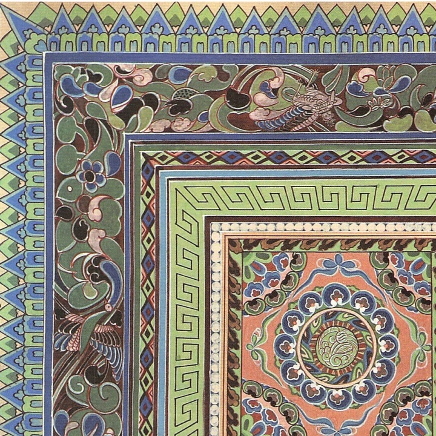
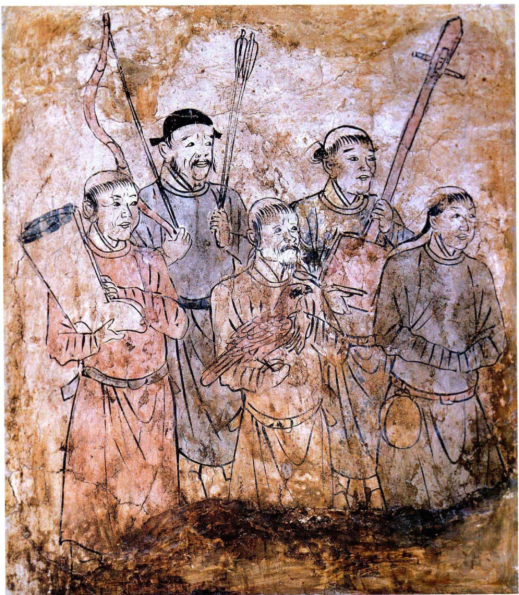
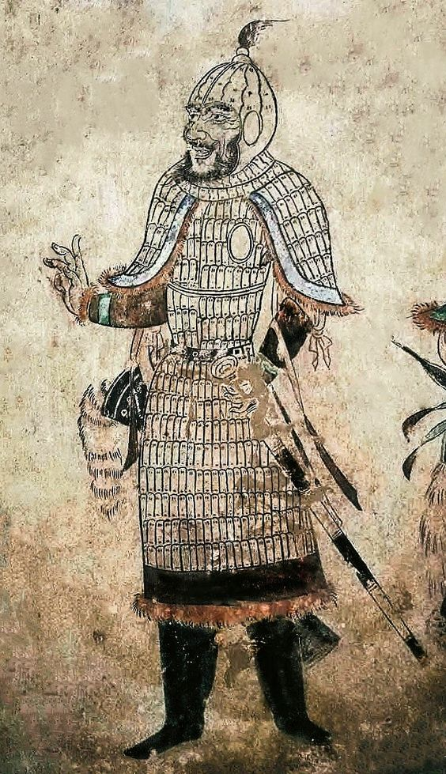
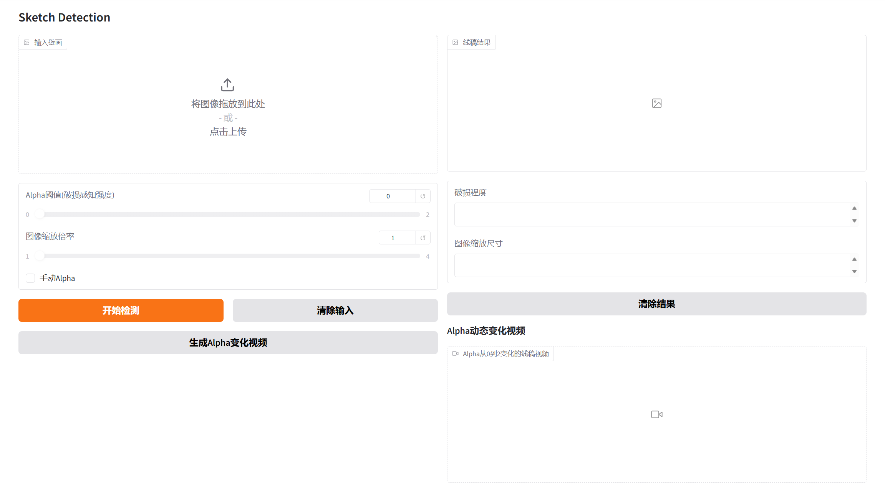

# MGDF

The code will be open source in the June.

---

## Detection Results Display

Below are the detection results for different mural images:

| Mural | Multi-scale Detection |
|--------|----------|
|  | [View Detection Video](images/1.mp4) |
|  | [View Detection Video](images/2.mp4) |
|  | [View Detection Video](images/3.mp4) |
|  | [View Detection Video](images/4.mp4) |
|  | [View Detection Video](images/5.mp4) |
|  | [View Detection Video](images/6.mp4) |
|  | [View Detection Video](images/7.mp4) |
|  | [View Detection Video](images/8.mp4) |

### Gradio Interface Demo

This project uses the Gradio framework to build an interactive user interface for model inference and visualization. The image below shows the design and functionality of the Gradio interface:

The interface provides an intuitive way for users to input data, adjust parameters, and view the model's output results in real-time.
